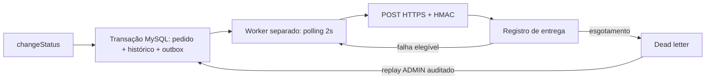

# RFC — Webhooks outbound de pedidos

**Autor:** Renan Santos, com assistência do Codex. **Data:** 2026-09-19. **Status:** proposta documental; decisões da reunião registradas, implementação não iniciada.
**Revisores propostos / participantes da reunião:** Larissa (Tech Lead), Marcos (PM), Bruno (Engenharia), Diego (Plataforma), Sofia (Segurança). Não implica revisão já realizada por eles.

## Problema e proposta
Três clientes fazem polling de pedidos; produto aceita menos de 10s em operação normal e solicita outbound. Propõe-se materializar no MySQL um snapshot de order.status_changed na mesma transação de changeStatus. Um processo separado busca eventos a cada 2s, envia HTTPS assinado e registra resultado. Falhas transitam por retry e, ao esgotar a política, para dead letter recuperável por ADMIN. O [PRD](PRD.md) delimita produto; o [FDD](FDD.md) detalha contratos propostos.

O replay reinsere evento pending; a seta para o banco não significa alterar novamente o pedido. UUID e payload são preservados como proposta de idempotência, ainda a ratificar para replay.

## Decisões centrais
| Tema | Decisão da reunião | Registro |
|---|---|---|
| Atomicidade | Outbox no MySQL existente, junto à mudança de status | [ADR-001](adrs/ADR-001-outbox-mysql.md) |
| Resiliência | Backoff e dead letter separada com replay | [ADR-002](adrs/ADR-002-retry-dead-letter.md) |
| Autenticidade | HMAC-SHA256, segredo por endpoint, rotação 24h | [ADR-003](adrs/ADR-003-hmac-endpoint.md) |
| Garantia | At least once e UUID em X-Event-Id | [ADR-004](adrs/ADR-004-at-least-once.md) |
| Execução | Worker separado, polling 2s, inicialmente único | [ADR-005](adrs/ADR-005-worker-polling.md) |
| Integração | Padrões Express/Prisma/Zod/AppError/Pino | [ADR-006](adrs/ADR-006-padroes-existentes.md) |

## Alternativas descartadas
1. Enviar HTTP dentro da transação do pedido: acopla latência/disponibilidade do receptor e aumenta risco de rollback. Rejeitada na reunião [09:04] Bruno.
2. Redis Streams/novo cluster: introduz infraestrutura e operação adicionais; MySQL existente atende a versão inicial ([09:07] Diego).
3. Exactly once fim a fim: exige coordenação com consumidores e não elimina falha entre envio e confirmação local; UUID para deduplicação foi escolhido ([09:25] Diego).
4. Worker no processo HTTP: compartilha ciclo de vida e recursos; processo dedicado permite separação operacional ([09:11] Diego/Larissa).

## Operação, riscos e mitigação
O HTTP do pedido não espera o receptor. O worker usa mesma DATABASE_URL, conexão própria, lote limitado e índice status/created_at. Monitorar idade do evento, latência, tentativas, falhas e volume da dead letter; segredo não deve entrar em logs. Um worker simplifica sequência inicial, mas indisponibilidade reduz vazão e retry pode afetar ordenação. A retenção futura evita crescimento indefinido; sem política aprovada, não apagar registros automaticamente. Mudanças de esquema/worker e contratos externos só seguem após revisão.

## Pontos abertos antes de implementação
| ID | Pergunta e evidência | Responsável sugerido | Impacto |
|---|---|---|---|
| Q01 | Cinco tentativas totais ou inicial + cinco retries? [09:17] cita cinco intervalos | Larissa / Diego | Bloqueia contador e teste de esgotamento |
| Q02 | Evento posterior do mesmo pedido espera retry anterior? [09:12] pede ordenação sem definir falhas | Larissa / Diego | Bloqueia algoritmo de seleção e SLA por pedido |
| Q03 | Como receptor recebe/valida duas chaves durante 24h? [09:21–22] não fixa formato da assinatura | Sofia | Bloqueia contrato de rotação |
| Q04 | Qual taxa máxima por endpoint/cliente? [09:38–39] deixa para observar | Diego / Marcos | Limite e proteção de receptores pendentes |
| Q05 | Retenção/arquivamento após ~30 dias e dados de resposta? [09:08] fora do escopo inicial | Diego / Sofia | Crescimento e privacidade precisam acompanhamento |
| Q06 | Quais restrições de destino HTTPS e acesso por customer_id? JWT é operador e CRUD é autenticado | Sofia / Larissa | Revisão de segurança antes de produção |
| Q07 | Quais códigos HTTP repetem, semântica de DELETE e UUID no replay? Não fixados na reunião | Larissa / Bruno | Propostas no FDD devem ser ratificadas |

## Plano de entrega e revisão
A reunião sugere três sprints e revisão de Segurança dois dias úteis antes do deploy. Sequência técnica proposta: schema/outbox atômico e cadastro; worker/entregas/retry; replay/rotação/observabilidade e validação. Não converter isso em prazo garantido. Primeiro aprovar documentos e resolver Q01–Q03/Q06–Q07. Não haverá código runtime nesta entrega acadêmica; avaliação documental usa [TRACKER](TRACKER.md) e validação reproduzível no README.
